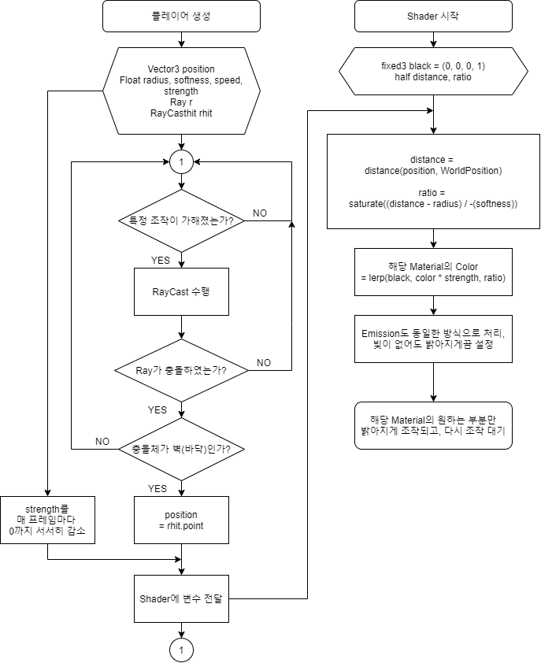

# Sense
홍익대학교 컴퓨터공학전공 2021-2 졸업작품

---

# Project Instruction

This project's goal is to make First-Person View 3D game through Unity.

The basic concept is to provide psychological anxiety by limiting control, such as moving, viewing, etc.

---

# Theme & Concept

The theme is 'Loss of five senses', so the concept of this game is to solve the puzzle that require the combination of senses at the state of limited activity, which make the player to immerse in the character that has no senses except the sense of touch.

The player can recover the lost sense when they get over some stages : this is the goal of each stages. They will feel psychological anxiety because of limited sense, and get the sense of achievement when they get over it.

---

# Development Environment

- Project Member : Jeong-Hui Kim (B611046)
- Project Period : 3 months
- OS : Windows
- Development Tool
    - Unity Editor
    - Visual Studio Code
    - Blender
    - GIMP
    - Inkscape
    - Natron

---

# Development Stage

1. **Design the game.** The basic blueprint is essential for development. I designed the structure of stages, concept of each stage, and control method of the player.
2. **Make the 3D model of the stages.** The world of the game must be made before the algorithm. It makes easier to adjust project.
3. **Develop functions of each object.** Character control, object animation, graphic shader, and UI scripts are included.
4. **Test, feedback, debug.** These works clear the problems of the project, and solve some bugs.

---

# Game Setup

This game has 24 stages. They are in the 4 floors which is Pipe-Shaped, so each floor has 6 stages.(can be changed)

The player can recover new sense at each floor, and use it to go next floor.

                 <Sketch of the stages>

The player will play the game with First-Person View, and move with WASD key and mouse.

Mouse click act like the character's hand. The clicked point, such as wall or object will be showed its partial shape.

**1F:**

The character doesn't have any sense except the sense of touch, so it can't see anything, can't hear any sound. The player has to touch objects to recognize surrounding environment, and move forward carefully to clear the game.

To get over the stages, players need to find some clues to open the door. The clues are provided by stimulating players' enabled senses. For example, the clues about touch would be provided by vibration, and players can recognize it with signal of screen.

**2F:**

Now the player can hear sound, but can't feel any of other sense. Still can feel touch, but not as much as 1F. The player has to follow where the specific signal sound be heard. Sometimes, there would be voice of helper. He/She will advise the way to goal.

**3F:**

Now the player can see the world, but can't hear sound. Jump is available because it's safe now. The player has to get over some dangerous place.  It could be like platform-game, 3D maze, mirror room, or trap room.

**4F:**

Now the player can use all sense. This floor reuses of previous stages, but little changed. The player need to use senses with combination. When he/she be stuck, changing the sense would be help to clear the stage.

---

# Key Algorithm

There were some obstacle while developing project. Graphic Shader was one of them. I had to make the world absolutely dark, and light up the part the player touched. This function is developed by shader script. Below is the flow chart of the algorithm.

